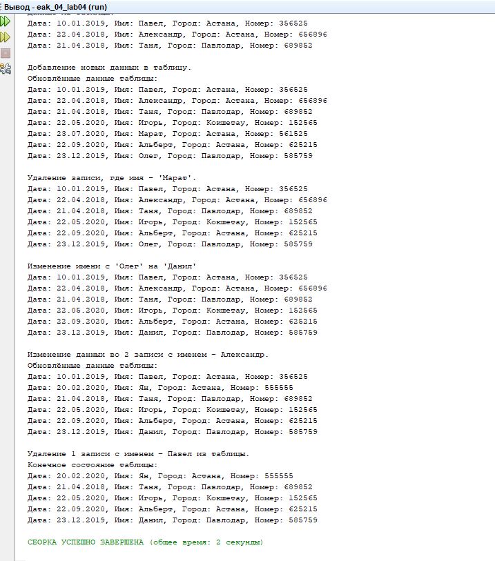

# eak04_lab04
# Решение 4 лабораторной работы
# Реализация программы с использованием технологии Hibernate и базы данных
# Вариант - 4 (Блокнот)

# Вывод


# Скрипт для создания таблицы:
```
CREATE TABLE IF NOT EXISTS `notebook` (
    `id` INT NOT NULL AUTO_INCREMENT,
    `date` VARCHAR(20) NULL DEFAULT NULL,
    `name` VARCHAR(11) NULL DEFAULT NULL,
    `city` VARCHAR(45) NULL DEFAULT NULL,
    `num` VARCHAR(20) NULL DEFAULT NULL,
    
    PRIMARY KEY (`id`)
) ENGINE=INNODB DEFAULT CHARSET=UTF8MB4 COLLATE = UTF8MB4_0900_AI_CI;

INSERT INTO notebook ( date, `name`, `city`, num) VALUES ("10.01.2019", "Павел", "Астана", "356525");
INSERT INTO notebook ( date, `name`, `city`, num) VALUES ("22.04.2018", "Александр", "Астана", "656896");
INSERT INTO notebook ( date, `name`, `city`, num) VALUES ("21.04.2018", "Таня", "Павлодар", "689852");

SET GLOBAL time_zone = '+6:00';
```
